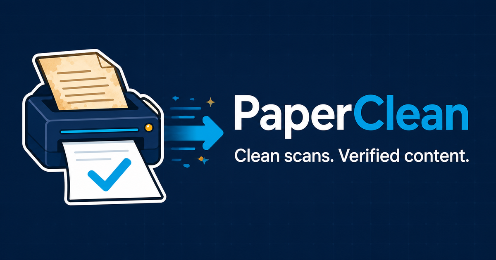
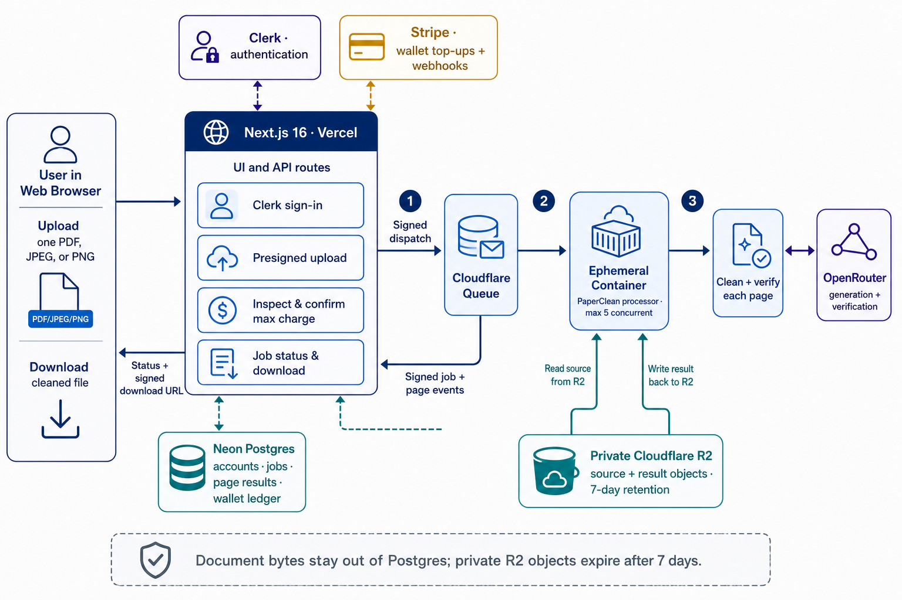

<div align="center">
  

  **🧹 Clean scans. Verified content. 🧹**

  [Live Demo](https://paperclean.tsilva.eu)
</div>

PaperClean Web is a pay-as-you-go web app for people who need clean PDFs or images from document photos and poor scans without silently accepting changed content. Upload one PDF, JPEG, or PNG, review the maximum charge, and download the verified result; pages that fail verification fall back safely and are not billed.

The live service combines a Next.js interface with private uploads, per-page processing, wallet billing, and automatic seven-day file expiry. A credential-free local preview is available for reviewing the complete upload and payment flow without sending a document anywhere.

[](https://paperclean.tsilva.eu)

## Install

PaperClean Web requires Node.js 22 or newer and pnpm 10.

```bash
git clone https://github.com/tsilva/paperclean-web.git
cd paperclean-web
pnpm install --frozen-lockfile
pnpm dev
```

Open [http://localhost:3000](http://localhost:3000). Without service credentials, the app runs as a clearly labelled interactive preview.

For the connected app, copy the environment template, add the Clerk, Neon, Stripe, Cloudflare, and job-signing values, then apply the database schema:

```bash
cp .env.example .env.local
pnpm db:migrate
```

## Commands

```bash
pnpm dev                          # start the local app
pnpm build                        # build the production app
pnpm lint                         # run ESLint
pnpm typecheck                    # check TypeScript
pnpm test                         # run the Vitest suite
pnpm db:migrate                   # apply Drizzle migrations
pnpm --dir cloudflare typecheck   # check the Cloudflare orchestrator
(cd processor && uv run ruff check . && PYTHONPATH=src uv run pytest)  # check the processor
```

## Notes

- Each account can run one job at a time. Supported uploads are PDF, JPEG, and PNG files up to 100 MB and 100 pages.
- Clerk handles sign-in, Stripe funds the USD wallet, and Neon Postgres stores accounts, jobs, page results, and ledger entries.
- Source and result files stay in a private Cloudflare R2 bucket and expire after seven days. Document contents are not stored in Postgres.
- Cloudflare Queues dispatch work to ephemeral containers with at most five concurrent processors. Page pixels are sent to the configured OpenRouter models for cleaning and verification.
- The maximum charge is confirmed before processing. Only pages that pass verification are billed; failed or original-fallback pages cost nothing.
- Full local processor checks also require Python 3.13 or newer and `uv`; run `uv sync --frozen --all-groups` inside `processor/` before the first check.

## Deploy

1. Connect the repository to Vercel and configure the values in `.env.example`.
2. Point Clerk and Stripe webhooks at `/api/webhooks/clerk` and `/api/webhooks/stripe`.
3. Create the private `paperclean-private` R2 bucket with a seven-day lifecycle, plus the `paperclean-jobs` queue and `paperclean-jobs-dlq`.
4. Deploy the Cloudflare orchestrator with `pnpm --dir cloudflare deploy`, then configure matching dispatch and callback secrets in Cloudflare and Vercel.

Keep R2 private. Never log signed URLs, uploaded content, prompts, model responses, or document text.

## Architecture



## License

No license file has been added yet.
